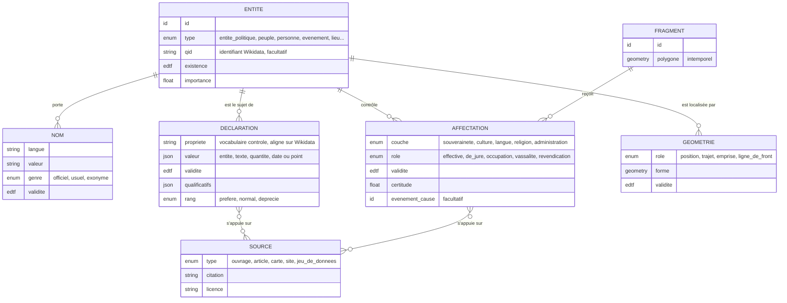
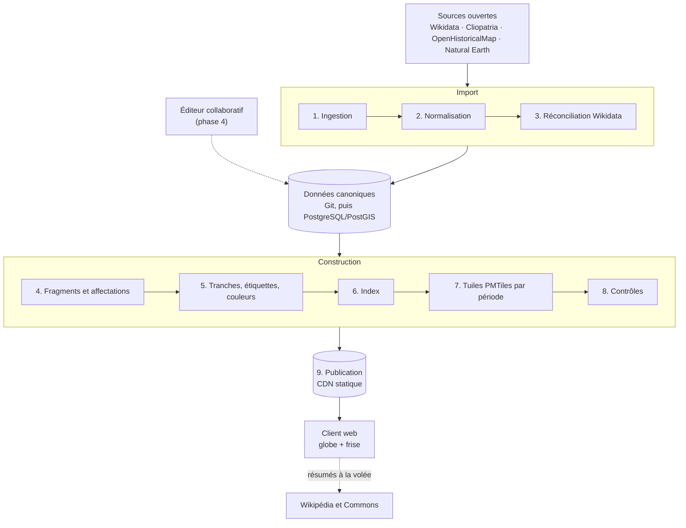

# WikiMap — Plan d'implémentation

> **WikiMap** : un atlas historique libre et collaboratif. Un globe terrestre et une frise
> chronologique : en faisant défiler le temps, les frontières des États et des peuples, les
> personnages et les événements (guerres, révolutions, traités…) évoluent de façon fluide.

Statut : **proposition v0.1** (octobre 2026), à discuter. Une fois validée, chaque décision
structurante sera consignée dans un ADR (*Architecture Decision Record*) dans `docs/adr/`.

## Sommaire

1. [En bref](#1-en-bref)
2. [Vision produit](#2-vision-produit)
3. [L'existant et notre positionnement](#3-lexistant-et-notre-positionnement)
4. [Décisions structurantes](#4-décisions-structurantes)
5. [Modèle de données](#5-modèle-de-données)
6. [Rendu et fluidité](#6-rendu-et-fluidité)
7. [Pipeline de données](#7-pipeline-de-données)
8. [Organisation du code](#8-organisation-du-code)
9. [Feuille de route](#9-feuille-de-route)
10. [Préparer l'éditeur collaboratif dès maintenant](#10-préparer-léditeur-collaboratif-dès-maintenant)
11. [Risques et parades](#11-risques-et-parades)
12. [Gouvernance et communauté](#12-gouvernance-et-communauté)
13. [Questions ouvertes](#13-questions-ouvertes)
14. [Prochaines étapes](#14-prochaines-étapes)
- [Annexe A — Sources de données candidates](#annexe-a--sources-de-données-candidates)
- [Annexe B — Glossaire](#annexe-b--glossaire)

---

## 1. En bref

**Ce que l'on construit** : une application web (globe 3D + frise zoomable) qui montre l'état
du monde à n'importe quelle date, et la base de données temporelle ouverte qui l'alimente.

**Stratégie** : ne pas refaire ce qui existe déjà. Les connaissances (personnes, événements,
liens entre eux) viennent de Wikidata ; les géométries de départ viennent de jeux de données
ouverts (Cliopatria, OpenHistoricalMap, Natural Earth) ; les textes viennent de Wikipédia et
sont affichés à la volée. Ce que WikiMap apporte en propre :

1. l'expérience « Google Maps du passé » : un globe fluide piloté par le temps ;
2. un modèle de données où le temps est natif, conçu dès le départ pour l'édition collaborative ;
3. l'agrégation de ces sources, avec des identifiants et des formats interopérables.

**Décisions clés proposées**

| # | Décision | Pourquoi |
|---|----------|----------|
| 1 | **Le temps est une donnée de premier rang.** Tout objet porte un intervalle de validité saisi en EDTF (avec son incertitude), converti en bornes numériques (années décimales, calendrier grégorien proleptique). | Rendu fluide, dates incertaines, calendriers multiples. |
| 2 | **Territoires = fragments atomiques intemporels + affectations datées** (« qui contrôle ce morceau de terre, de quand à quand, selon quelle source »), plutôt que des polygones redessinés à chaque date. | Pas de trous ni de chevauchements, édition locale, conquêtes animables, « histoire d'un lieu » immédiate. |
| 3 | **Lecteur 100 % statique** : tuiles vectorielles PMTiles découpées par période et servies par un CDN. Aucun serveur applicatif tant que l'éditeur n'existe pas. | Coût proche de zéro, tient la charge, projet facile à forker. |
| 4 | **Moteur : MapLibre GL JS 6 en projection globe.** Le changement de date ne déclenche un recalcul qu'au franchissement d'une date de changement (index précalculé), avec un fondu en double tampon ; deck.gl vient en appoint pour les couches denses. À valider sur un prototype mesuré. | Libre, tuiles vectorielles, étiquettes de qualité, globe natif. |
| 5 | **Licences fixées avant la première contribution externe.** | Elles ne peuvent plus changer ensuite sans l'accord de tous les contributeurs. |
| 6 | **Données « as code » avant l'éditeur** : base canonique en fichiers texte validés dans Git, contributions par pull request. Migration vers PostgreSQL/PostGIS quand l'éditeur en ligne arrive. | Historique, relecture et attribution dès le premier jour, sans infrastructure. |

**Feuille de route**

| Phase | Contenu | Ordre de grandeur* |
|-------|---------|--------------------|
| 0 | Cadrage, licences, prototypes techniques (rendu, fragments, Wikidata) | 2 à 4 semaines |
| 1 | **Atlas politique** : globe, frise, frontières fluides, fiches | 2 à 3 mois |
| 2 | **Atlas vivant** : événements, personnages, villes, peuples, recherche | 2 à 3 mois |
| 3 | **Données ouvertes** : fragments, contributions par PR, publications versionnées | ~2 mois |
| 4 | **Éditeur collaboratif** en ligne (modèle wiki) | 4 à 6 mois et plus |
| 5 | **Extensions** : trajets animés, paléogéographie, récits guidés, couches thématiques… | en continu |

\* Pour une équipe de 1 à 2 développeurs ; à réévaluer à la fin de la phase 0.

---

## 2. Vision produit

### 2.1 Expérience cible

- **Un globe, une frise.** La frise, en bas de l'écran, se manipule comme une carte : on la fait
  glisser, on zoome (des millénaires jusqu'au jour près). Le globe se met à jour en continu, sans
  écran de chargement.
- **Des transitions qui racontent.** Une conquête « déborde » sur le territoire conquis, un empire
  qui éclate se fragmente en fondu, une frontière mal connue apparaît floue.
- **Cliquer, c'est comprendre.** Un territoire, une ville, une bataille ou un personnage ouvre une
  fiche valable à la date affichée : nom d'époque, dirigeants, capitale, guerres en cours, résumé
  Wikipédia, sources.
- **« Histoire de ce lieu ».** Un clic n'importe où donne la succession des souverainetés, des
  peuples et des événements en ce point, de la préhistoire à nos jours.
- **Lecture automatique** à vitesse réglable, et bouton « changement suivant » qui saute au
  prochain changement de frontière dans la zone affichée.
- **Tout est partageable.** L'URL encode la date, la vue, les couches et la sélection
  (ex. `/1453-05-29/@41.01,28.97,6z`).
- **Recherche.** « Napoléon », « guerre de Cent Ans », « Tenochtitlan » : la carte se place au bon
  endroit et au bon moment.

### 2.2 Couches

| Couche | Contenu | Phase |
|--------|---------|-------|
| Fond physique | Relief, végétation, côtes, lacs, fleuves, glaciers, sans aucun élément moderne | 1 |
| Entités politiques | États, empires, royaumes, cités-États, avec leur hiérarchie (vassaux, membres du Saint-Empire, provinces) | 1 |
| Événements | Batailles, guerres (théâtres d'opérations, belligérants), révolutions, traités, catastrophes, fondations | 2 |
| Personnages | Dirigeants, savants, artistes… positionnés selon leur vie | 2 |
| Villes | Noms d'époque, statut (capitale), population quand elle est connue | 2 |
| Peuples et cultures | Aires culturelles ou ethniques, souvent floues et superposées | 2 |
| Mouvements | Migrations, campagnes militaires, explorations, routes commerciales (trajets animés) | 5 |
| Paléogéographie | Côtes selon le niveau marin, calottes glaciaires, cours des fleuves | 5 |
| Thématiques | Langues, religions, démographie, économie | 5 |
| Récits | Parcours guidés : une suite d'étapes (date, cadrage, couches, texte) | 5 |

### 2.3 Principes

1. **Le temps d'abord.** Aucune donnée sans intervalle de validité. L'absence de date est une
   information explicite (« inconnue »), pas un oubli silencieux.
2. **Vérifiabilité.** Chaque affirmation et chaque tracé renvoient à des sources, sans travail
   inédit, comme sur Wikipédia.
3. **L'incertitude se voit.** La frontière de l'empire hittite n'a pas la précision de celle de
   1990 : la carte doit le montrer (flou, hachures, transparence).
4. **Pluralité des points de vue.** Territoires contestés, sources divergentes, souveraineté de jure
   et de facto, périodisations qui ne soient pas seulement européennes.
5. **« Pas de données » n'est pas « pas d'État ».** Les sociétés sans État (peuples, chefferies,
   nomades) sont représentées : une zone vide ne doit jamais suggérer une terre vide.
6. **Interopérabilité.** Identifiants Wikidata partout, formats ouverts, exports réguliers.
7. **Sobriété.** Statique d'abord, hébergement peu coûteux, utilisable sur un ordinateur modeste.

---

## 3. L'existant et notre positionnement

### 3.1 Projets proches

| Projet | Ce que c'est | Ce qu'on en retient |
|--------|--------------|---------------------|
| **OpenHistoricalMap** (OHM) | « OpenStreetMap du passé » : base collaborative de géométries datées (`start_date`, `end_date`), données CC0, carte 2D avec curseur temporel. | Le plus proche par l'esprit, avec une infrastructure d'édition éprouvée. À traiter comme source et partenaire plutôt que comme concurrent. |
| **Chronas** | Atlas mondial (≈ 2000 av. J.-C. – 2000) découpé en provinces auxquelles on affecte, année par année, souverain, culture et religion ; fiches Wikipédia ; édition ouverte. | Montre que le modèle « provinces + affectations » est simple à éditer. Sa limite : des provinces figées. Le modèle de fragments en est la généralisation. |
| **ChronoAtlas** (2026) | Carte web (MapLibre 6) des frontières de -3400 à aujourd'hui, construite sur OHM, Cliopatria et CShapes ; code MIT, données propres en CC0, contributions sourcées. | Très proche de notre phase 1, et valide l'approche (index des changements, tuiles par époque). À contacter avant de coder. |
| **Cliopatria** (Seshat) | Frontières d'environ 1 600 entités politiques, de -3400 à 2024 (publié en 2025). | Meilleure base de départ mondiale pour la phase 1. |
| **historical-basemaps** | Cartes du monde en GeoJSON à une cinquantaine de dates. | Utile pour comparer, mais la licence (GPL) convient mal à une base de données. |
| **CShapes 2.0** | Frontières des États souverains de 1886 à 2019. | Référence pour l'époque contemporaine. |
| **GeaCron, Running Reality, Euratlas** | Atlas historiques commerciaux. | Références d'expérience utilisateur, pas de données réutilisables. |
| **Wikidata** | Graphe de connaissances, CC0. | Source principale pour personnes, événements et entités ; identifiants (QID). |
| **World Historical Gazetteer, Pleiades, PeriodO** | Gazetiers historiques, définitions de périodes. | Lieux anciens, noms d'époque, périodisations régionales. |

### 3.2 Positionnement

| Option | Description | Pour | Contre |
|--------|-------------|------|--------|
| A. Visionneuse seule | Afficher OHM et Wikidata, sans base propre | Rapide, rien à maintenir côté données | Couverture inégale, aucun contrôle sur le modèle (fragments, importance, hiérarchies) |
| B. Plateforme indépendante | Tout refaire, base comprise | Contrôle total | Effort énorme, doublon de Wikidata et d'OHM, communauté à bâtir de zéro |
| **C. Hybride (recommandé)** | Visionneuse + base propre limitée à ce que les autres ne font pas (territoires datés en fragments, données d'affichage, liens), fédérée avec Wikidata (QID) et OHM | Valeur propre claire, pas de doublon, échanges possibles | Exige de la rigueur sur les identifiants et les licences |

**Avant d'écrire du code**, prendre contact avec ChronoAtlas et OpenHistoricalMap. Là où leurs
objectifs recoupent les nôtres (frontières en 2D, imports de données, outils de pipeline), mieux
vaut contribuer ou mutualiser que dupliquer. WikiMap se distingue par le globe, les couches de
connaissances (événements, personnages, peuples), le modèle de fragments et l'éditeur
collaboratif.

---

## 4. Décisions structurantes

### 4.1 Licences

| Objet | Proposition | Raison |
|-------|-------------|--------|
| Code de l'application et du pipeline | **AGPL-3.0** | Un service en ligne dérivé de WikiMap doit rester libre. |
| Bibliothèques réutilisables (`packages/time`…) | **MIT** | Adoption la plus large possible. |
| Données apportées par la communauté | **CC0** (recommandé) ou CC BY-SA 4.0 | Voir ci-dessous. |
| Données importées | **Licence d'origine conservée par enregistrement** | Traçabilité ; publication par couche et par licence, comme le fait Overture Maps. |
| Textes et images de Wikipédia et Commons | Non stockés : affichés à la volée avec attribution | Licence CC BY-SA, et licence propre à chaque fichier sur Commons. |

|  | CC0 (comme Wikidata et OHM) | CC BY-SA 4.0 (comme les textes de Wikipédia) |
|--|-----------------------------|----------------------------------------------|
| Réutilisation | Totale, sans condition | Attribution et partage à l'identique |
| Peut alimenter Wikidata et OHM | Oui | Non |
| Peut intégrer des données CC BY ou CC BY-SA | Seulement en les isolant (licence par enregistrement) | Oui |
| Protection contre l'appropriation | Aucune | Oui |

**Recommandation** : CC0 pour les contributions, ce qui permet d'échanger dans les deux sens avec
les deux projets les plus proches (Wikidata et OHM), et licence d'origine conservée pour chaque
enregistrement importé. Une donnée dérivée d'un enregistrement CC BY reste CC BY : la licence suit
la lignée de l'enregistrement.

**Pourquoi trancher maintenant** : OpenStreetMap a changé de licence en 2012 (de CC BY-SA vers
ODbL) et a dû supprimer les contributions des personnes qui n'avaient pas donné leur accord. Pour
les contributions, le code suit le DCO (*Developer Certificate of Origin*, ligne `Signed-off-by`)
et les données exigent une acceptation explicite de la licence au moment de contribuer.

### 4.2 Le temps

**Saisie et stockage « humains » en EDTF** (*Extended Date/Time Format*, normalisé dans
ISO 8601-2) :

| Exemple EDTF | Sens |
|--------------|------|
| `1453-05-29` | 29 mai 1453 |
| `1200~` | vers 1200 (approximatif) |
| `1066?` | 1066, date incertaine |
| `-0752` | 753 av. J.-C. (numérotation astronomique : l'année `0000` est 1 av. J.-C.) |
| `1914-07-28/1918-11-11` | intervalle |
| `../1500` | début inconnu, fin en 1500 |

**Bornes numériques calculées** pour l'indexation et le rendu : `debut_min`, `debut_max`,
`fin_min`, `fin_max`, en **années décimales astronomiques** (float64, calendrier **grégorien
proleptique**), plus une valeur nominale utilisée pour l'affichage. L'écart entre bornes mesure
l'incertitude, que le rendu peut montrer. On reprend la convention d'OpenHistoricalMap
(`start_decdate`, `end_decdate` : une année entière correspond au 1er janvier, `0.0` à l'an 1
av. J.-C.). Les données et l'extension MapLibre d'OHM restent ainsi directement compatibles.

Règles :

- **Intervalles semi-ouverts** `[début, fin[` : la fin d'un État peut coïncider avec le début de son
  successeur sans chevauchement.
- **Calendriers** : conversion à la saisie (julien, hégirien, républicain…), le calendrier d'origine
  étant conservé pour l'affichage. La révolution d'Octobre a eu lieu le 25 octobre 1917 julien,
  soit le 7 novembre grégorien ; Hastings, le 14 octobre 1066 julien, soit le 20 octobre grégorien.
  Le passage au grégorien varie selon les pays : 1582 en France, 1752 en Grande-Bretagne, 1918 en
  Russie.
- **Précision** : une date connue au siècle près ne doit jamais devenir le « 1er janvier 1300 ».
  La précision est conservée et affichée.
- **Préhistoire** : saisie possible en « BP » (*before present*, avant 1950) avec marge d'erreur,
  convertie dans la même échelle.
- **Une seule logique** : une bibliothèque `time` en TypeScript (client, futur éditeur) et son
  équivalent Python (pipeline), testées contre les **mêmes vecteurs de test** (fichiers JSON
  partagés : année 0, dates av. J.-C., bascule julien/grégorien, précisions Wikidata…).

### 4.3 Les territoires : fragments et affectations

**Le problème.** L'approche naïve stocke un polygone par État et par date. Les frontières communes
sont alors dupliquées entre voisins, ce qui produit des trous et des chevauchements. Modifier une
frontière impose de retoucher deux polygones de façon synchronisée, et rien ne dit *pourquoi* la
frontière a changé.

**Le modèle proposé** est celui des « géométries communes minimales » (*least common geometry*),
utilisé en SIG historique :

```text
Fragments (géométrie fixe)     Affectations datées (couche « souveraineté »)
┌──────┬──────┐                F1 : [1648, 1871[ France · [1871, 1918[ Empire allemand · [1918, …[ France
│  F1  │  F2  │                F2 : [1648, …[ France
├──────┼──────┤      ──►       F3 : …
│  F3  │  F4  │
└──────┴──────┘                Territoire de X à la date t = union des fragments affectés à X à t
```

- Les **fragments** forment une partition des terres émergées. Ils sont **intemporels** : couper un
  fragment pour tracer une frontière plus fine ne modifie jamais l'histoire, car les deux moitiés
  héritent de tout l'historique d'affectations. Le découpage ne fait que s'affiner.
- Une **affectation** porte : l'entité, l'intervalle de validité, le **rôle** (souveraineté
  effective, de jure, occupation, protectorat ou vassalité, revendication, condominium), un degré de
  certitude, des sources, et éventuellement l'**événement cause** (traité, conquête, héritage,
  indépendance).
- Plusieurs **couches** partagent les mêmes fragments : souveraineté, peuples et cultures, langues,
  religions, divisions administratives.
- La **hiérarchie** (vassaux, membres du Saint-Empire, provinces) passe par des relations datées
  entre entités, pas par la géométrie. Le rendu peut ainsi afficher le niveau supérieur aux petits
  zooms et le détail aux grands zooms.
- **Mers et côtes** : les fragments couvrent les terres et débordent grossièrement en mer. Le trait
  de côte est appliqué au moment de la construction des tuiles (découpe par un masque terre/mer), ce
  qui permettra plus tard des côtes qui varient dans le temps (niveau marin, polders, deltas).

| Approche | Avantages | Inconvénients |
|----------|-----------|---------------|
| Cartes instantanées (une carte du monde par date) | Très simple | Rien entre deux dates, pas d'identité des entités |
| Polygones versionnés par entité (comme Cliopatria, CShapes, OHM) | Simple à afficher, format natif des sources | Frontières communes dupliquées, trous et chevauchements, édition lourde, pas de sémantique du changement |
| Topologie d'arcs datés (style OSM ou TopoJSON) | Précis, sans duplication | Édition et validation complexes : chaque anneau doit rester fermé à chaque instant |
| **Fragments + affectations** (recommandé) | Partition sans trous ni chevauchements, édition locale au « pinceau temporel », changements animables, histoire d'un lieu immédiate, couches multiples | Import initial à soigner (superposition des sources, nettoyage des micro-fragments) ; finesse limitée par le découpage, mais affinable à volonté |

**Découplage clé** : le client ne consomme que des **tranches territoriales**, c'est-à-dire des
polygones fusionnés par entité et par période stable (le même format que des polygones versionnés).
La phase 1 peut donc afficher directement des données importées, et la phase 3 basculer la source de
vérité vers les fragments sans toucher au client.

### 4.4 Les connaissances : entités, déclarations, sources

- **Entités** typées : entité politique, peuple ou culture, personne, événement, lieu (ville, site),
  organisation, religion, langue…
- **Déclarations** sur le modèle de Wikidata : *(sujet, propriété, valeur, intervalle de validité,
  qualificatifs, sources, rang)*. Exemples : « Empire ottoman — capitale — Constantinople —
  [1453-05-29, 1922-11-01[ » ; « Bataille d'Austerlitz — vainqueur — Premier Empire ».
- **Vocabulaire de propriétés** restreint et contrôlé, chaque propriété ayant sa correspondance
  Wikidata.
- **Noms multilingues et datés** : Byzance, Constantinople, Istanbul. Chaque nom a un type
  (officiel, usuel, exonyme).
- **Partage des rôles avec Wikidata** : Wikidata reste la référence pour « ce qui existe »
  (identité, QID) ; WikiMap ajoute « où et quand précisément » (géométries dans le temps) et les
  données d'affichage (importance, couleurs, positions d'étiquettes). Une entité WikiMap peut exister
  sans QID, par exemple une petite seigneurie absente de Wikidata.
- **Identité des entités politiques** (Rome républicaine ou impériale ? France capétienne ou
  royaume de France ?) : on suit par défaut la granularité de Wikidata, reliée par des relations de
  continuité (« succède à », « devient »). C'est une question de politique éditoriale à documenter
  tôt.

### 4.5 Diffusion statique d'abord

Tant qu'il n'y a pas d'éditeur en ligne, le site complet est un ensemble de fichiers statiques :
l'application, les tuiles PMTiles (un fichier par couche et par période, lu par requêtes HTTP
*range*), des index JSON (recherche, dates de changement) et un manifeste de version. N'importe quel
stockage objet derrière un CDN suffit. Conséquences : coût quasi nul, aucune faille serveur,
montée en charge gratuite, et n'importe qui peut héberger un miroir ou un fork.

### 4.6 Pile technique

| Domaine | Choix proposé | Alternatives écartées pour l'instant | Raison |
|---------|---------------|--------------------------------------|--------|
| Carte et globe | **MapLibre GL JS 6.x** (globe depuis la v5 ; v6.11 en octobre 2026) | CesiumJS : très bon modèle temporel et vrai 3D, mais dates av. J.-C. mal gérées nativement, rendu vectoriel encore expérimental, plus lourd. Mapbox GL JS : non libre | Libre, tuiles vectorielles, étiquettes de qualité, globe natif |
| Couches animées denses | **deck.gl 9.4** via `@deck.gl/maplibre`, si le prototype le justifie | Shaders écrits à la main | Filtrage temporel sur GPU, trajets animés (`TripsLayer`) |
| Tuiles | **PMTiles** (spécification v3) produites par **tippecanoe** | Serveur de tuiles (Martin, Tegola) | Fichiers statiques, aucun serveur |
| Relief | **Mapterhorn** (tuiles d'altitude *terrarium*), ombrage et teintes hypsométriques de MapLibre | AWS Terrain Tiles (licences hétérogènes) | Données ouvertes, fonctionne sur le globe ; attributions à afficher |
| Client | **TypeScript**, **Vite** | — | Typage partagé avec le schéma |
| Interface | **Svelte 5** (léger) ou **React** (plus grand vivier de contributeurs), à trancher | — | Le moteur reste indépendant de ce choix |
| Frise | Composant maison (Canvas) avec **d3-scale** et **d3-zoom** | vis-timeline | Besoins très spécifiques (zoom, densité, halos) |
| Pipeline | **Python 3.12+**, **uv**, **DuckDB** (extension spatiale), **Shapely 2** / GeoPandas, **mapshaper** | Tout en SQL PostGIS | Écosystème géospatial le plus riche |
| Données canoniques (phases 1 à 3) | Fichiers texte (JSON, GeoJSON) dans Git, validés par **JSON Schema** | Base de données dès le départ | Historique et relecture gratuits |
| Base de données (phase 4) | **PostgreSQL + PostGIS** | Wikibase (excellent pour les déclarations, faible pour les géométries) | Géométries, contraintes temporelles, maturité |
| Recherche | Index statique (MiniSearch), puis moteur serveur (plein texte PostgreSQL ou Meilisearch) | — | Statique d'abord |
| Hébergement | Stockage objet acceptant les requêtes HTTP *range* + CDN (Cloudflare R2 sans frais de sortie, ou tout équivalent compatible S3 ; GitHub Pages pour les prototypes de moins de 1 Go) | Serveur dédié | Coût, simplicité |
| Tests | **Vitest**, **Playwright** (captures, images/s), **pytest** | — | Régressions visuelles et de performance |

---

## 5. Modèle de données



**Exemples** (YAML, pour la lisibilité ; le format exact sera fixé par le JSON Schema) :

```yaml
# Une entité politique
id: E000123
type: entite_politique
qid: Q12560                       # Empire ottoman
existence: "1299~/1922-11-01"
noms:
  - { langue: fr, valeur: "Empire ottoman", validite: "1299~/1922-11-01" }
declarations:
  - propriete: capitale
    valeur: E004567               # Constantinople
    validite: "1453-05-29/1922-11-01"
    sources: [S000042]
---
# Une affectation : l'Alsace annexée par l'Empire allemand
fragment: F0098812
couche: souverainete
entite: E000777                   # Empire allemand
role: effective
validite: "1871-05-10/1918-11-11"
evenement_cause: E000888          # Traité de Francfort
sources: [S000101]
---
# Un événement
id: E000999
type: evenement
qid: Q83224                       # bataille d'Hastings (QID indicatif)
existence: "1066-10-14"           # calendrier julien d'origine, conservé
calendrier_origine: julien
geometries:
  - { role: position, forme: { type: Point, coordinates: [0.4875, 50.9125] } }
```

**Invariants vérifiés automatiquement** (en CI, puis par l'éditeur, avec le même code) :

- pas deux affectations de même couche et de même rôle sur un fragment au même instant (sauf
  souverainetés partagées explicitement déclarées) ;
- chaque affectation et chaque déclaration a au moins une source, ou une provenance d'import ;
- les noms et déclarations restent dans la durée d'existence de leur entité ;
- géométries valides (OGC), fragments sans chevauchement entre eux ;
- dates EDTF valides, bornes ordonnées, précision cohérente ;
- avertissements (non bloquants) : bataille hors de la vie de ses participants, capitale hors du
  territoire, etc.

---

## 6. Rendu et fluidité

### 6.1 Globe et fond de carte

- **MapLibre GL JS** en projection globe, qui passe d'elle-même en Mercator vers le zoom 12.
- **Fond de carte intemporel** : relief ombré (altitudes Mapterhorn), teintes hypsométriques et de
  végétation, côtes, lacs, fleuves. Aucun élément moderne (routes, villes, frontières actuelles).
- **Style typographique d'atlas** : capitales espacées pour les empires, italiques pour les peuples,
  noms de villes d'époque. Thèmes clair et sombre.
- **Couleurs des entités** stables dans le temps et distinctes de leurs voisines : coloration de
  graphe sur les adjacences de toute la période, avec couleurs « traditionnelles » modifiables
  (la France en bleu, l'Empire britannique en rose…). Palette lisible par les daltoniens.

### 6.2 Données temporelles côté client

- Les tuiles vectorielles sont **découpées en compartiments temporels** (un fichier PMTiles par
  couche et par période). Chaque compartiment contient les objets qui recoupent sa période, avec
  leurs bornes exactes ; le filtre côté client fait la sélection fine.
- **Compartiments de taille adaptative**, pour un volume de données à peu près constant : par
  exemple 250 ans pour l'Antiquité, 25 ans au XIXe siècle, 5 ans au XXe (à calibrer).
- **Préchargement** du compartiment suivant dans le sens du défilement, cache LRU. L'état précédent
  reste affiché tant que le suivant n'est pas prêt : jamais d'écran vide.
- **Niveaux de détail** : géométries simplifiées aux petits zooms, entités mineures masquées.

### 6.3 Filtrer le temps à 60 images par seconde

**Le constat.** Dans MapLibre, changer la date dans un filtre (`setFilter`, ou `global-state`
utilisé dans un filtre) fait redécouper toute la source dans les *workers*. L'opération est
asynchrone (l'ancien rendu reste affiché pendant le calcul) : acceptable de temps en temps, mais pas
à chaque image d'un glissement. D'où trois idées complémentaires.

1. **Index des changements.** Une frontière change à des dates précises et rien ne bouge entre
   deux changements. Pour chaque compartiment chargé, le pipeline fournit la liste triée des dates
   de changement. Quand la date bouge, on ne refiltre que si l'on franchit l'une d'elles.
   ChronoAtlas, qui procède ainsi, annonce éviter plus de 99 % des recalculs.
2. **Double tampon.** Le calque des territoires existe en deux exemplaires, chacun avec sa propre
   source pour que le recalcul de l'un ne touche pas l'autre. L'exemplaire caché reçoit le nouveau
   filtre ; quand il est prêt, on bascule par un fondu d'opacité de calque (`fill-layer-opacity`
   piloté par `global-state`). Cette mise à jour coûte très peu et s'anime depuis MapLibre 6.11.
   Le fondu ne dépend donc ni de la vitesse de défilement ni du temps de calcul. Si l'utilisateur
   va plus vite que le calcul, on saute les états intermédiaires : un seul refiltrage à la fois,
   toujours vers la date la plus récente.
3. **Le GPU pour les couches denses.** Pour des dizaines de milliers de points (événements,
   personnages) ou des trajets animés, deck.gl (`DataFilterExtension`, `TripsLayer`) filtre dans
   le shader : changer la date revient à changer un seul paramètre (*uniform*).

| Technique | Coût d'un changement de date | Usage prévu |
|-----------|------------------------------|-------------|
| Filtre MapLibre (`setFilter`, ou `global-state` dans un filtre) | Élevé : la source est redécoupée | Territoires et étiquettes, uniquement au franchissement d'un changement |
| Opacité de calque (`fill-layer-opacity` piloté par `global-state`) | Très faible, animable | Fondus du double tampon |
| `feature-state` | Faible : mise à jour objet par objet sur le fil principal | Coloration directe des fragments, surbrillances |
| deck.gl `DataFilterExtension` | Quasi nul | Points denses, trajets animés |
| Opacité calculée par objet selon la date (`["get", …]` dans une propriété de peinture) | Élevé : redécoupage | À éviter |

Précautions :

- Les étiquettes doivent être *filtrées*, pas seulement rendues transparentes : une étiquette
  invisible occupe toujours sa place dans la détection des collisions.
- deck.gl avec MapLibre 6 passe par `@deck.gl/maplibre` (`MapLibreOverlay`, deck.gl 9.4) : un seul
  calque intercalé par carte, et certaines couches (`TextLayer`, icônes non tournées vers la caméra)
  ne s'affichent pas sur le globe avec les réglages par défaut. Les valeurs sont en float32 : en
  années décimales, la précision reste de l'ordre de quelques heures, ce qui suffit.

**Hypothèse de travail** : MapLibre seul pour les territoires (index des changements + double
tampon), deck.gl seulement si les couches de points l'exigent. Le prototype A de la phase 0
tranchera, mesures à l'appui.

### 6.4 Transitions

- **Fondu enchaîné** à chaque franchissement d'un changement : l'ancien et le nouvel état se
  fondent en quelques centaines de millisecondes (double tampon du § 6.3), quelle que soit la
  vitesse de défilement.
- **« Pulsation » des zones qui changent de mains** : un contour lumineux qui s'estompe, surtout
  utile en lecture automatique. Le modèle de fragments donne exactement ces zones.
- **Étiquettes** : apparitions et disparitions en fondu (natif dans MapLibre) ; positions
  précalculées (pôle d'inaccessibilité du territoire, puis à terme étiquettes courbes le long de
  l'axe du territoire, comme dans les atlas imprimés).
- **Pas de morphing géométrique généralisé** : coûteux, et trompeur parce qu'il invente des
  frontières intermédiaires. On le réserve aux cas où il a du sens, comme des lignes de front datées
  (1914–1918, 1939–1945) ; deck.gl sait interpoler des tracés sur GPU, à nombre de sommets égal.

### 6.5 Densité : zoom spatial et zoom temporel

- Chaque entité reçoit un **score d'importance** : liens interlangues Wikipédia, consultations,
  indices publiés (Pantheon…), ajustement éditorial.
- **Dans l'espace** : le score fixe le zoom minimal d'affichage et la priorité des étiquettes.
- **Dans le temps** : une bataille d'un jour serait invisible quand on parcourt les siècles. Chaque
  événement ponctuel reçoit donc un **halo temporel** proportionnel à la plage de temps visible, et
  seuls les événements assez importants pour ce « zoom temporel » sont affichés. C'est la logique des
  étiquettes de carte, appliquée au temps.

### 6.6 La frise

- **Zoomable** comme une carte : la molette zoome autour du curseur, le glisser déplace. Graduations
  adaptatives : millénaires, siècles, décennies, années, mois, jours.
- **Mini-frise de contexte** à échelle compressée (logarithmique) pour sauter de -10 000 à
  aujourd'hui.
- **Bandes de périodes** (Antiquité, Moyen Âge, Edo, Song…) **dépendantes de la région affichée** :
  la « Renaissance » n'a pas de sens au Japon. Les définitions viennent de PeriodO.
- **Histogramme de densité** des événements de la zone visible : où se passe-t-il quelque chose ?
- **Lecture** en « années par seconde », vitesse adaptée au zoom ; boutons « changement
  précédent / suivant ».
- **Repères de l'entité sélectionnée** sur la frise (dates clés de la France si on a cliqué sur
  la France).
- **Date affichée** avec la précision adaptée au zoom (« 1453 », « mai 1453 », « 29 mai 1453 »),
  en grégorien par défaut, d'autres calendriers plus tard.
- **Clavier** : flèches pour avancer ou reculer d'un pas, Maj pour un grand pas, Espace pour la
  lecture.

### 6.7 Fiches, recherche, histoire d'un lieu

- **Fiche** : données WikiMap, plus le résumé Wikipédia dans la langue de l'utilisateur (avec
  repli), attribué et lié ; images de Wikimedia Commons avec auteur et licence.
- **Recherche** : index statique chargé à la demande (MiniSearch ou équivalent), remplacé plus tard
  par un moteur côté serveur.
- **Histoire d'un lieu** : point cliqué → fragment → historique de ses affectations, plus les
  événements proches.
- **Panneau « Le monde en 1453 »** : entités majeures, guerres en cours, dirigeants.

### 6.8 Langues, accessibilité, mobile

- Interface traduite (français et anglais d'abord). Noms des entités dans la langue de l'utilisateur
  *à la date affichée*, avec repli (langue choisie, puis anglais, puis nom local).
- Frise utilisable au clavier, panneaux accessibles (ARIA), respect de `prefers-reduced-motion`,
  contrastes suffisants.
- Mobile : gestes tactiles, interface simplifiée, données allégées.

### 6.9 Budget de performance (mesuré en CI)

| Indicateur | Cible |
|------------|-------|
| Premier affichage (ordinateur moyen, 4G) | < 3 s |
| Glissement de frise, ordinateur moyen | ≥ 55 images/s (p95) |
| Glissement de frise, mobile milieu de gamme | ≥ 30 images/s |
| JavaScript initial | < 500 Ko gzip |
| Mémoire | < 500 Mo |

Ces mesures sont automatisées avec Playwright (scénario de glissement scripté), ce qui empêche les
régressions silencieuses.

---

## 7. Pipeline de données



1. **Ingestion** : un connecteur par source. Chaque instantané brut est conservé avec sa date et sa
   licence.
2. **Normalisation** vers le schéma canonique : dates EDTF, noms multilingues, provenance.
3. **Réconciliation** avec Wikidata (QID) : appariement automatique sur nom, dates et lieu, puis file
   de vérification manuelle pour les cas douteux.
4. **Fragmentation** (phase 3) : superposition de tous les polygones territoriaux, accrochage,
   suppression des micro-fragments sous un seuil de surface, création des affectations. Les
   chevauchements et les trous sont listés dans un rapport à examiner.
5. **Construction** : fusion par entité et par période stable (pour chaque niveau de hiérarchie),
   points d'étiquette, lignes de frontière, couleurs.
6. **Index** : recherche, dates de changement par région (bouton « changement suivant »),
   histogrammes de densité.
7. **Tuilage** : tippecanoe, puis un fichier PMTiles par couche et par compartiment temporel.
   Options utiles : `--detect-shared-borders` (les frontières communes restent identiques après
   simplification) et un zoom minimal par objet, dérivé de l'importance. À proscrire sur des objets
   datés : les options de fusion (`--coalesce-*`) et d'agrégation, qui mélangent des objets aux
   intervalles de validité différents.
8. **Contrôles** : invariants, validité des géométries, captures de référence à des dates clés
   (-500, 800, 1453, 1648, 1815, 1914, 1945, 2000) comparées d'une version à l'autre.
9. **Publication** : envoi immuable et versionné avec un manifeste (versions des sources, dates des
   requêtes, commit du code). Le client lit le manifeste ; un build est reproductible.

---

## 8. Organisation du code

Monorepo :

```text
WikiMap/
├── apps/
│   └── web/              # application : Vite + TypeScript + framework UI
├── packages/
│   ├── engine/           # moteur carte + temps, indépendant du framework UI
│   ├── time/             # EDTF, calendriers, années décimales (licence permissive)
│   ├── schema/           # JSON Schema du modèle canonique + types TypeScript générés
│   └── style/            # style MapLibre, sprites, polices (glyphes)
├── pipeline/             # ETL Python (uv) : ingestion → normalisation → fragments → tuiles
├── data/                 # données canoniques (phases 1 à 3) ; dépôt séparé quand elles grossiront
├── docs/
│   ├── PLAN.md
│   └── adr/              # décisions d'architecture
└── .github/workflows/    # CI : lint, tests, validation des données, build, déploiement
```

- **`engine` est indépendant du framework d'interface** : la carte et la frise sont du code
  impératif performant ; l'interface (panneaux, recherche, réglages) est un client de cette API.
  On pourra changer de framework, ou intégrer le moteur ailleurs (widget embarquable), sans tout
  réécrire.
- **Outillage** : pnpm (workspaces), Biome ou ESLint + Prettier, Vitest, Playwright ; Ruff, pytest
  et un vérificateur de types côté Python ; GitHub Actions ; Renovate ou Dependabot.
- **Aperçu déployé pour chaque pull request**, y compris les PR de données : un relecteur voit le
  changement sur le globe avant de fusionner.
- Les sorties du pipeline (tuiles) ne sont jamais versionnées dans Git : elles vont dans le
  stockage objet. Les instantanés de sources volumineux non plus : ils sont publiés comme artefacts
  datés.

---

## 9. Feuille de route

### Phase 0 — Cadrage et prototypes (2 à 4 semaines)

- Valider ce plan, trancher les licences, rédiger les premiers ADR : licences, modèle du temps,
  modèle des territoires, stratégie statique.
- Prendre contact avec ChronoAtlas et OpenHistoricalMap (§ 3.2).
- Mettre en place le monorepo, la CI et le déploiement d'aperçus.
- **Prototype A — rendu temporel** : Cliopatria entier sur le globe, frise basique. Comparer sur
  le même jeu de données l'index des changements avec double tampon, la coloration de fragments
  par `feature-state` et le filtrage GPU de deck.gl (§ 6.3). Mesurer images par seconde, temps
  d'image p95, délai d'un refiltrage et mémoire, sur un ordinateur moyen et un téléphone moyen.
- **Prototype B — fragments** : fragmenter Cliopatria sur l'Europe et la Méditerranée ; mesurer le
  nombre de fragments, la part de micro-fragments, le temps de calcul ; vérifier qu'en refusionnant
  on retrouve les polygones d'origine.
- **Prototype C — Wikidata** : extraire batailles, guerres, dirigeants et personnages (dates, lieux,
  coordonnées) ; mesurer volumes et qualité, calculer un premier score d'importance.

*Sortie* : ADR rédigés ; techniques de rendu et modèle de territoires validés par des mesures.

### Phase 1 — Atlas politique (2 à 3 mois)

1. Fond de carte physique en style atlas, sur globe.
2. Frise v1 : zoom, déplacement, lecture, date dans l'URL.
3. Entités politiques importées (Cliopatria et compléments), tuiles par période, fondus,
   étiquettes, hiérarchie selon le zoom.
4. Fiche v1 : nom à la date, période d'existence, résumé Wikipédia (français et anglais) quand le
   QID est connu.
5. Déploiement continu, mesures de performance et captures de référence en CI.

*Sortie* : on parcourt de -3000 à aujourd'hui à 55 images/s ou plus ; un lien vers « 29 mai 1453,
Constantinople » reproduit exactement la vue.

### Phase 2 — Atlas vivant (2 à 3 mois)

1. Extraction Wikidata reproductible, avec scores d'importance.
2. Événements : batailles (points), guerres (théâtres et belligérants mis en évidence), révolutions,
   traités ; visibilité selon le zoom temporel.
3. Personnages : positionnés le long de leur vie (naissance, résidences ou fonctions, mort), densité
   selon l'importance, portraits.
4. Villes avec noms d'époque et population quand elle est connue.
5. Première couche de peuples et cultures (données à constituer, voir § 11).
6. Recherche, « histoire de ce lieu », panneau « le monde en… ».

*Sortie* : une dizaine de scénarios de référence sont cohérents et agréables à parcourir : chute de
Constantinople, guerre de Cent Ans, Empire mongol, Révolution française, unité italienne,
décolonisation de l'Afrique…

### Phase 3 — Données canoniques ouvertes (~2 mois)

1. Schéma canonique v1 (JSON Schema) et sa documentation.
2. Fragmentation des données importées ; régression : les tranches refusionnées correspondent aux
   sources.
3. Dépôt de données avec validation en CI (schéma, invariants, géométries) et aperçu sur le globe
   de chaque PR de données.
4. Outils de contribution : une CLI (`wikimap affecter --fragments … --entite … --validite …`), un
   projet QGIS type, des guides.
5. Politique éditoriale v0 : vérifiabilité, neutralité, territoires contestés, conventions de
   nommage.
6. Publications versionnées des données (exports GeoJSON/GeoParquet/CSV, DOI via Zenodo).

*Sortie* : un contributeur externe corrige une frontière par PR en moins d'une heure, guide en main ;
la CI attrape les données invalides.

### Phase 4 — Éditeur collaboratif en ligne (4 à 6 mois et plus)

Hors périmètre immédiat, mais préparé dès maintenant (voir § 10).

- PostgreSQL + PostGIS comme source de vérité ; API ; comptes (OAuth : Wikimedia, GitHub,
  OpenStreetMap, ou e-mail).
- Révisions par enregistrement, historique, différences, annulation, listes de suivi, pages de
  discussion.
- Outils cartographiques : sélection de fragments et **« pinceau temporel »** (affecter une zone à
  une entité sur un intervalle), découpe d'un fragment par un trait avec accrochage, tracé
  d'événements et de trajets, aperçu avant/après, source obligatoire.
- Modération : niveaux de confiance, modifications en attente de relecture sur les entités
  sensibles ou très vues, file de patrouille, protections, filtres anti-abus.
- Publication incrémentale : une modification déclenche la reconstruction des seules tuiles et
  périodes touchées.

### Phase 5 — Extensions (en continu)

Trajets animés (campagnes militaires, explorations, migrations, routes commerciales) ;
paléogéographie (côtes selon le niveau marin, glaciations) ; récits guidés ; cartes anciennes
géoréférencées en surimpression (IIIF) ; couches langues, religions et démographie ; application
mobile ; API pour la recherche ; assistance à la saisie par IA (proposer des déclarations sourcées à
partir de textes, *toujours* validées par un humain).

---

## 10. Préparer l'éditeur collaboratif dès maintenant

Rien de l'éditeur n'est à coder aujourd'hui, mais six choix faits dès la phase 1 éviteront de tout
refaire :

1. **Identifiants stables**, jamais réutilisés, indépendants des noms.
2. **Enregistrements fins** : une affectation, une déclaration, un nom = un enregistrement. Les
   révisions, différences et annulations deviennent naturelles, et les conflits rares.
3. **Provenance partout** : source, lot d'import, auteur, licence.
4. **Règles de validation partagées** : le JSON Schema et les invariants (§ 5) vivent dans un paquet
   utilisé à la fois par la CI et, plus tard, par l'API de l'éditeur.
5. **Construction incrémentale possible** : le pipeline sait quelles tuiles et périodes dépendent de
   quels enregistrements.
6. **Exports réguliers dès le début** : la base est publique et réutilisable même sans éditeur.

Notes de conception pour plus tard :

- **Modèle wiki plutôt que temps réel** : révisions avec contrôle de concurrence optimiste (« vous
  modifiez la révision 42, qui a changé entre-temps »), sans CRDT au début. Deux personnes éditent
  rarement le même fragment à la même seconde ; elles ont surtout besoin d'historique et de
  discussion.
- **Contraintes temporelles en base** : contraintes d'exclusion PostgreSQL (`btree_gist`) pour
  interdire deux affectations qui se chevauchent dans le temps.
- **Aperçu instantané** : la modification en cours est rendue côté client en surimpression, pendant
  que le pipeline reconstruit les tuiles.
- **Échanges avec Wikidata et OpenHistoricalMap** : suggestions de QID, et export des sous-ensembles
  dont la licence le permet.

---

## 11. Risques et parades

| Risque | Parade |
|--------|--------|
| Données lacunaires et biaisées (eurocentrisme, « vides » trompeurs, peuples sans données) | Sources diversifiées, couche peuples dès la phase 2, incertitude affichée, « pas de données » distinct de « pas d'État », contributeurs de toutes les régions |
| Histoire contestée et guerres d'édition (Cachemire, Crimée, Kosovo, Taïwan…) | Politique de neutralité, statut « contesté » explicite, affichage de jure et de facto, protections et modération |
| Contamination de licence | Licence et provenance par enregistrement, contrôle automatique dans le pipeline, aucun import sans licence claire |
| Performance quand les données s'accumulent | Compartiments temporels, niveaux de détail, mesures en CI |
| Dérive du périmètre | Phases avec critères de sortie ; la phase 1 se limite aux frontières politiques |
| Dépendance aux services externes (API Wikipédia, points d'accès Wikidata) | Instantanés datés, caches, dégradation gracieuse |
| Épuisement d'un projet porté par une seule personne | Architecture simple, documentation, petites livraisons, communauté associée tôt |
| Personnes vivantes et RGPD | Couche personnages limitée aux personnalités publiques et aux personnes décédées ; règles inspirées des « biographies de personnes vivantes » de Wikipédia |
| Lois encadrant la représentation des frontières dans certains pays | Statut contesté explicite, nommage neutre, avis juridique avant tout partenariat local |
| Confusion de nom (Wikimapia, outils Wikimedia) | Vérifier la disponibilité du nom avant toute communication publique |

---

## 12. Gouvernance et communauté

- **Dès maintenant** : README, CONTRIBUTING, code de conduite, ADR publics, feuille de route
  publique, tickets « good first issue ».
- **Phase 3** : politique éditoriale v0 (vérifiabilité, neutralité, sources acceptées, territoires
  contestés, nommage), inspirée de Wikipédia et adaptée aux cartes.
- **Plus tard** : structure juridique (association), financement (dons, subventions publiques pour
  le logiciel libre et le patrimoine numérique), partenariats académiques (équipes de Seshat et
  Cliopatria, gazetiers historiques), liens avec les communautés Wikimedia et OpenHistoricalMap.

---

## 13. Questions ouvertes

1. **Licence des données** : CC0 (recommandé) ou CC BY-SA 4.0 ?
2. **Public prioritaire** : grand public et enseignement, ou chercheurs ? Le choix influe sur
   l'interface et sur la précision attendue.
3. **Profondeur temporelle du MVP** : de -3000 à aujourd'hui, avec la préhistoire plus tard ?
4. **Langues au lancement** : français et anglais ?
5. **Framework d'interface** : Svelte ou React ?
6. **Relation avec OpenHistoricalMap** : simple source, partenaire, ou contribution directe de nos
   géométries ?
7. **Nom du projet** : « WikiMap » est proche de Wikimapia, un site existant.
8. **Hébergement et budget** : qui paie le CDN et le stockage, et à quelle échelle ?

---

## 14. Prochaines étapes

- [ ] Relire ce plan et répondre aux questions ouvertes (dans la pull request).
- [ ] Contacter ChronoAtlas et OpenHistoricalMap pour identifier ce qui peut être mutualisé.
- [ ] ADR-001 Licences, ADR-002 Modèle du temps, ADR-003 Territoires, ADR-004 Diffusion statique.
- [ ] Monorepo, CI et aperçus de déploiement.
- [ ] Prototype A : rendu temporel, avec mesures.
- [ ] Prototype B : fragments sur l'Europe et la Méditerranée.
- [ ] Prototype C : extraction Wikidata.
- [ ] Revue des résultats, ADR-005 Moteur de rendu, lancement de la phase 1.

---

## Annexe A — Sources de données candidates

Licences marquées « à confirmer » : à vérifier avant tout import.

| Source | Contenu | Licence | Usage prévu |
|--------|---------|---------|-------------|
| Wikidata | Entités, personnes, événements, dates, lieux | CC0 | Connaissances, QID |
| Wikipédia | Résumés d'articles | CC BY-SA 4.0 | Affichage à la volée |
| Wikimedia Commons | Images | Licence propre à chaque fichier | Affichage à la volée |
| Natural Earth | Côtes, fleuves, lacs, relief | Domaine public | Fond de carte |
| Cliopatria | Frontières de -3400 à 2024 | À confirmer | Territoires, phase 1 |
| OpenHistoricalMap | Géométries datées | CC0 | Compléments, échanges |
| CShapes 2.0 | États souverains 1886–2019 | À confirmer | Époque contemporaine |
| historical-basemaps | Cartes du monde à une cinquantaine de dates | GPL (à confirmer) | Comparaison seulement |
| PeriodO | Définitions de périodes | CC0 | Bandes de la frise |
| Pleiades | Lieux antiques | CC BY (à confirmer) | Villes et sites antiques |
| World Historical Gazetteer | Lieux historiques | À confirmer | Noms d'époque |
| Pantheon | Personnalités, indice de popularité historique | À confirmer | Score d'importance |

## Annexe B — Glossaire

| Terme | Définition |
|-------|------------|
| **Affectation** | Lien daté entre un fragment et une entité (« ce fragment appartient à X de telle date à telle date, selon telle source »). |
| **Compartiment temporel** | Tranche de temps pour laquelle on produit un fichier de tuiles. |
| **EDTF** | *Extended Date/Time Format* : syntaxe normalisée pour les dates incertaines, approximatives ou partielles. |
| **Fragment** | Morceau de terre de géométrie fixe ; les fragments forment une partition du globe. |
| **PMTiles** | Format d'archive de tuiles en un seul fichier, lisible directement par requêtes HTTP *range*. |
| **QID** | Identifiant d'un élément Wikidata (ex. `Q12560`). |
| **Tranche territoriale** | Polygone d'une entité pendant une période où son territoire ne change pas ; c'est ce que le client affiche. |
